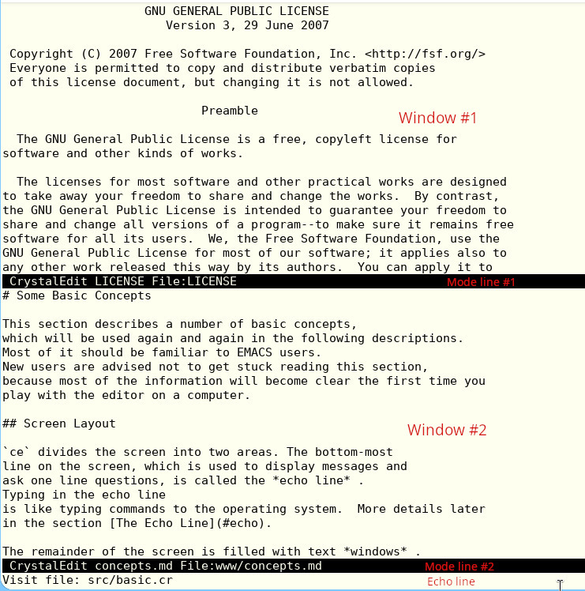

# Some Basic Concepts

This section describes a number of basic concepts,
which will be used again and again in the following descriptions.
Most of it should be familiar to EMACS users.
New users are advised not to get stuck reading this section,
because most of the information will become clear the first time you
play with the editor on a computer.

## Screen Layout

`ce` divides the screen into two areas. The bottom-most
line on the screen, which is used to display messages and
ask one line questions, is called the *echo line*.
Typing in the echo line
is like typing commands to the operating system.  More details later
in the section [The Echo Line](#echo).

The remainder of the screen is filled with text *windows* .
When `ce` is first started, there will be one or two more windows,
depending on how many files you specify on the invocation line.
If there is only one window, it fills the screen.  If there are two
or more windows, each window occupies an equal share of the screen.
Windows can be created, deleted, and adjusted in
size using `ce` commands.

## Mode Lines

The last line of a window (the line, usually in reverse video,
that starts with `CrystalEdit`) is the *mode line*  for the window.
It contains information about what is being displayed in the
window. Mode lines separate windows from each other and from the
echo line.

Four important bits of information are displayed in the mode line.
These are:

* the *buffer changed flag* (either a `*` or blank)
* the buffer *mode*  (if any) in parentheses
* the *buffer name*
* the *file name*

A window is always displaying a buffer.  The name of the buffer being displayed in the window is
shown in the mode line, right after the
`CrystalEdit` and the buffer mode (if any).

A buffer may have a file associated with it.
Usually this is the last file read into or written from the
buffer. If a file is associated with the buffer, the name of the
file is displayed in the mode line, prefixed by `File:`.

`ce` knows if a buffer has been changed since it was last
written to its associated file. It informs you of this fact by displaying
a `*` in the mode line immediately to the left of the `CrystalEdit`
string.

## Keyboard Conventions

Internally, `ce` represents keyboard characters in a special
31 bit code. This code consists of 21 bits of character data (ASCII plus
Unicode), and 3 flags: the *CONTROL* flag, the *META* flag, and the *CTLX* flag.
Combinations of the three flags are possible, with the exception that
META and CTLX cannot be set at the same time.

This manual represents 31 bit keycodes in a standard way. If you
have a character `A`, then that character with
the *CONTROL* bit set is
written as **C-A**. That character with the
*META* bit set is written as **M-A**.
That character with the *CTLX* bit set is written as **C-X A**.
If both the META and CONTROL bits are set, it is written as **M-C-A**.
If both the CTLX and CONTROL bits are set, it is written as **C-X C-A**.

Characters with the flag bits set are entered by prefixing the
desired character with another character, as follows:

* To get a character with the *CONTROL* bit set,
hold down the `CTRL` key while entering the character.
An alternative method
is to prefix the character with `Control-^` (the
word `Control` here, and in the next few examples, means the key marked
`Control` or `CTRL` on the ASCII keyboard).

* To get a character with the
*META* bit set, prefix the character
with `Control-[`, `Escape`, or `ESC`.  An alternative method that
works on FlexOS is to
hold down the `ALT` key while entering the character.  This method
also works on PC-DOS, but only with `ALT-A` through `ALT-Z`.

* To get a character with the
*CTLX* bit set, prefix the character
with `Control-X`.

* To get a character with the *CONTROL*
and *META* bits set, prefix the character
with `Control-\`.  An alternative method is to prefix the character
with `ESC`, then hold down `CTRL` while entering the character.

CONTROL characters
are very important, so there is a shorthand way
of typing them, as follows:

* Characters between `Control-@` (`Control-Space` on some keyboards)
and `Control-Z` are mapped
to the characters `@` through `Z` with the *CONTROL* bit set.

* Characters between
`Control-a` and `Control-z` are mapped to
the characters `A` through `Z`
with the *CONTROL* bit set.

This shorthand means that that **M-C-V**, for example, can be entered 
either as
`ESC` followed by `Control-V`, or as `Control-\` followed by `V`.
As another example, **C-X C-B** is entered as `Control-X` followed
by `Control-B`.

### The PC Keyboard

`ce` understands all of the cursor keypad and function keys
on a typical keyboard.  These keys include the function keys
(F1-F12), cursor keys (Up, Down, Left,
Right, PgUp, PgDn, Home, End), Delete, and Insert.

You can use the `ALT` key  as the META flag, instead of the `ESC` key.
For example, the **M-L** command
(lower-word) can be executed in either of two ways:

* Hit `ESC` followed by `L`.

* Hold down `ALT` and hit `L`.

The `ALT` key only works with alphabetic
characters (`A` through `Z`).
Using `ALT` and `CTRL` together is also not supported.

## Key Bindings

Normally when you type a key, `ce` attempts to
interprets the key as a command.  Internally, `ce` keeps a table
of each possible key, and the command assocated
with that key.  This association is called the "key binding."  
Even text keys,
such as the letters, numbers, and punctuation, are "bound" to a command
called "ins-self"
that just inserts the key that invoked it into the text.

Not all commands are bound to a particular
key.  These commands can still be entered by using
the (**M-X**) (`ESC X`) "extended-command"
prefix.

See the [Quick Start](quickstart.md) section of this manual for a list of the
predefined key bindings.

In this guide, the command descriptions will give not only the
key that the command is normally bound to, but also the command name,
which is useful when you want to use that command in a Ruby extension.

## The Echo Line

The echo line has two purposes; displaying messages and asking one
line questions.

Two types of messages are displayed in the echo line.
Informational messages tell you something useful, but do not imply in any
way that something is wrong. These messages are always enclosed in square
brackets ([ and ]).
Error messages indicate that something has
prevented a command from being executed. They are never enclosed in square
brackets, and will be accompanied by a beep from the terminal's bell if
the sound of the bell is not too obnoxious.

The echo line is cleared by the next keystroke.

The echo line is also used for asking and answering questions.
After the prompt, you can type any characters you like. The reply is always
terminated by a `Return`. Before you commit to the reply, you can edit the reply
using the following characters:

* `Backspace` or `Rubout`: delete the character to the left of the cursor.

* `Control-A`: move the cursor to the beginning of the line.

* `Control-B`: move the cursor one character to the left.

* `Control-D`: delete the character under the cursor.

* `Control-E`: move the cursor to end of the line.

* `Control-F`: move the cursor one character to the right.

* `Control-K`: delete from the cursor to the end of the line.

* `Control-U`: delete the entire line.

You can also abort the command in progress by typing `Control-G`.
Command processors are designed to ask all questions before doing nasty
things, so that you will never do damage by aborting a command.

The echo line supports autocompletion.  If you are entering
a command name, a filename, or a buffer name, you can use the
`Tab` key to tell `ce` to complete as
much of the entry as possible, based on what you have entered so far.
Pressing the the `Tab` key twice in a row will open a new temporary window containing
the list of possible choices.

If you are entering a search string, pressing `Control-S` will fill in
the previous search string.

## Command Arguments

All commands can be given a numeric argument.
Most commands use this
argument as a repeat count. Commands can tell if an argument has been
supplied, and will use a default argument if no user argument is present.
Usually, the default argument is `1`.

A **C-U** preceding a command always introduces an argument.

If a numeric argument is just a string of **C-U** characters, then the
value of the argument is
4^(number of **C-U** characters), where "^" means "to the power."
Therefore **C-U** is 4, **C-U C-U** is 16,
**C-U C-U C-U** is 64, and so on.
Some commands
care if an argument is present, but don't look at its value; the **C-U**
character is a good way to say "here is an argument".

If there is a signed decimal number after the string of
**C-U** characters it specifies the value of the argument. In this case
the number of **C-U** characters does not matter. An argument of 10 can be
represented by **C-U 10**,
**C-U C-U 10**, or even **C-U C-U C-U C-U 10**.

## Dot, Mark, and the Region

Most editing commands act on the character or characters surrounding
the current location in the current buffer.  The thing that marks the current
location is always called *dot* .  The dot always points between two
characters.  This isn't the way that the cursor works on most display terminals,
so, by convention, dot is always immediately to the left of the character
on which the hardware cursor is placed.

There is also a second remembered position in the buffer, called the
*mark* . There are commands that set the value of mark.

Some commands act on a block of text called the *region* .
The region is
all of the characters between dot and mark. The relative positions of dot
and mark do not matter.
